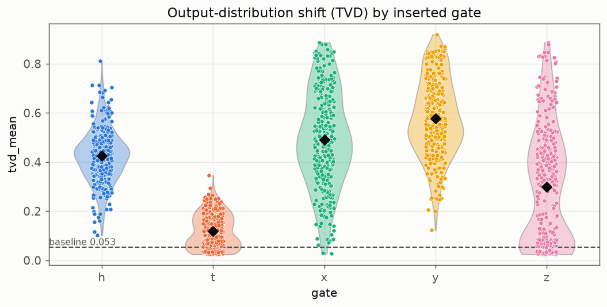
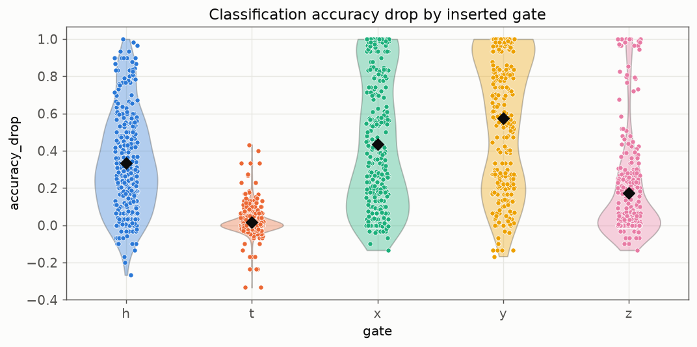
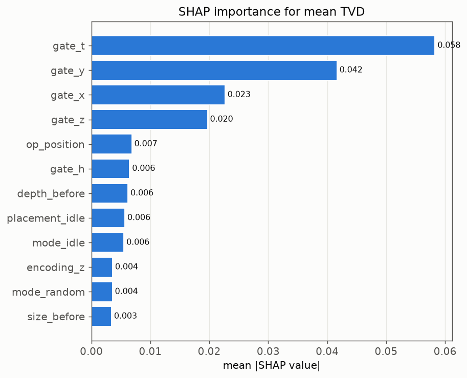
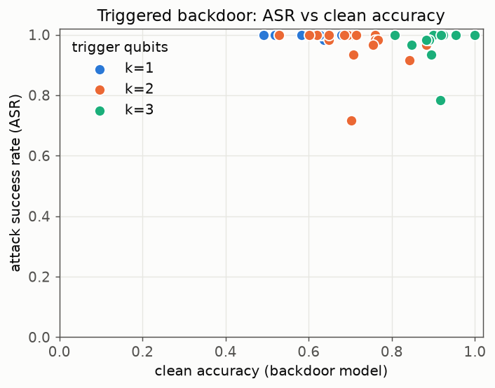
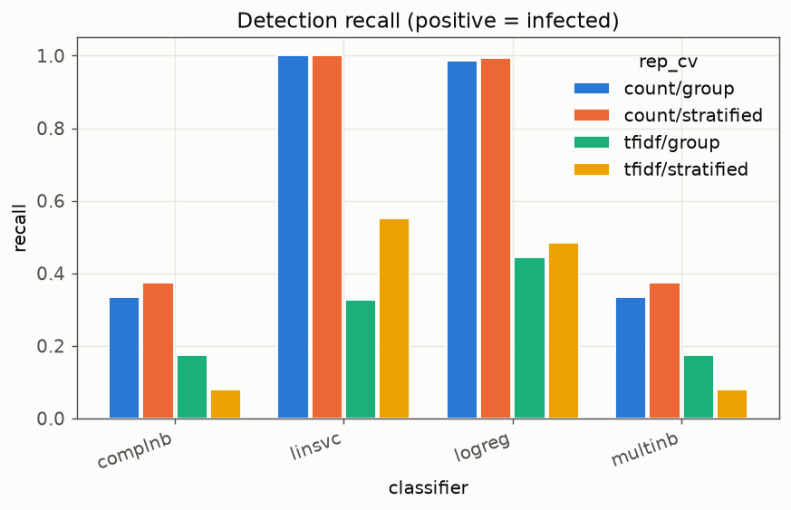
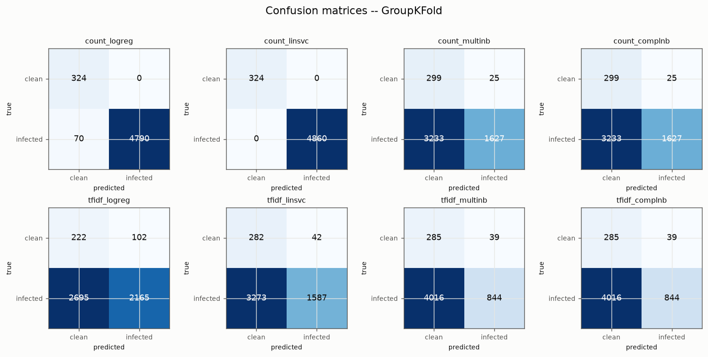

# qml-trojan-benchmark

**Security of Quantum Machine Learning against trojan / backdoor insertion.**

A reproducible, laptop-scale benchmark that studies what happens when a compromised quantum
software-supply-chain component (a malicious Qiskit transpiler pass) inserts gates into an
already-trained **Variational Quantum Classifier (VQC)**. It bridges two research directions:
**(1) trojan detection in quantum circuits** and **(2) Quantum Adversarial Machine Learning (QAML)**.

The study asks three questions:

- **(a)** What is the behavioural and **classification-accuracy** impact of single-gate insertions in VQCs?
- **(b)** Can a **trigger** degrade/flip classification only for specific inputs while preserving the rest (a **backdoor**)?
- **(c)** Can simple **text classifiers** (BoW/TF-IDF + classical ML) over the exported QASM tell clean VQCs from infected ones?

> This repository deliberately imitates the methodology of the quantum-trojan sensitivity work
> (gate-insertion dataset, TVD/BC/BD metrics, violin/strip plots, a text-detection table) and adds
> QAML-specific metrics (clean accuracy, accuracy drop, and attack success rate for a triggered backdoor).

---

## Adversarial model (software supply chain)

A once-trusted optimization dependency — a Qiskit **transpiler pass** — is compromised and begins
**inserting operations during compilation** of an already-trained VQC. The attacker controls
**neither** the algorithm source, **nor** the cloud provider, **nor** the hardware. The **defender**
has access to the **golden** (clean) and **infected** compiled artifacts and to their measurements.

This is implemented literally: the attack is a real `qiskit.transpiler.TransformationPass` run inside
a `PassManager`, so the infected circuit is produced by the compilation flow itself — exactly as in
the field.

---

## Method at a glance

| Stage | What it does |
|---|---|
| **Victim models** | Train golden VQCs: `{Z, ZZ}` angle encoding + `RealAmplitudes` ansatz, parity-expectation readout, over Iris / digits 0-vs-1 / Breast-Cancer (PCA to 2 or 4 qubits), 3 seeds. |
| **Trojan insertion** | A malicious pass inserts **one** gate `{H,T,X,Y,Z}` per variant in `random` / `idle` / `controlled` mode; 15 variants per model with full structural metadata. |
| **Triggered backdoor** | A conditional trojan (inverse-encoding detector + mid-circuit measured ancilla + classically controlled parity flip) that flips the class only under a trigger pattern. |
| **Sensitivity** | TVD / BC / BD over measured output distributions (512 shots × 15 reps) **vs a golden-vs-golden sampling baseline**, plus clean accuracy and accuracy drop; SHAP over structural attributes. |
| **Detection** | QASM-as-text (BoW & TF-IDF, uni+bigrams) × {LogReg, MultinomialNB, ComplementNB, LinearSVC} × {GroupKFold, StratifiedKFold}; full metric suite + confusion matrices. |

The victim/model architecture, the metrics, and every design decision are explained in depth, in
Portuguese, in [`docs/explicacao.md`](docs/explicacao.md).

---

## Installation

Requires **Python ≥ 3.10** (developed on 3.12), CPU only.

```bash
python -m venv .venv
# Windows:  .venv\Scripts\activate
# Linux/Mac: source .venv/bin/activate
pip install -r requirements.txt
pip install -e .          # installs the `qmltrojan` package
```

All dependency versions are pinned in [`requirements.txt`](requirements.txt).

---

## Reproducing the results

```bash
# Validate the whole pipeline end to end in a few minutes:
python scripts/run_all.py --quick

# Full benchmark (~1–1.5 h on a laptop CPU); writes to results/full/:
python scripts/run_all.py --config full
```

Run the stages individually with the same `--quick` / `--config full` flag:

```bash
python scripts/exp1_golden.py     --config full   # train golden VQCs, export QASM, clean accuracy
python scripts/exp2_trojans.py    --config full   # infect, sensitivity (TVD/BC/BD), accuracy drop, SHAP
python scripts/exp3_backdoor.py   --config full   # triggered backdoor: ASR vs clean accuracy
python scripts/exp4_detection.py  --config full   # text detection grid + confusion matrices
```

Run the tests and the didactic notebook:

```bash
pytest -m "not slow"          # fast unit tests
pytest -m slow                # end-to-end quick-pipeline test (a few minutes)
jupyter notebook notebooks/demo.ipynb
```

Outputs land in `results/<mode>/`: `golden/`, `infected/`, `backdoor/` (OpenQASM 3 files),
CSVs (`metadata`, `sensitivity`, `backdoor`, `detection_summary`, `inventory`, `errors`, `shap_*`),
and `figures/*.png`. Quick-mode outputs are git-ignored; full-mode outputs are versioned.

---

## Why OpenQASM 3?

A trained VQC is still a **parametric program**: weights are fixed numbers but data features are
run-time inputs. OpenQASM 2 cannot represent free parameters (`QASM2ExportError`), so each classifier
is exported as **OpenQASM 3** with features declared as `input float[64] _x_i_;`. Export/parse
round-trips are tested.

---

## Results

<!-- RESULTS:START -->

### 1. Clean accuracy of the golden VQCs

Trained **108** golden VQCs; mean clean test accuracy **0.840 ± 0.154**.

| dataset       |     z |    zz |
|:--------------|------:|------:|
| breast_cancer | 0.903 | 0.758 |
| digits01      | 0.985 | 0.816 |
| iris          | 0.993 | 0.585 |

### 2. Sensitivity (TVD) and accuracy impact

Across **1620** infected variants, mean TVD **0.382** vs a golden-vs-golden sampling baseline of **0.053**; mean accuracy drop **0.307**.

**By inserted gate:**

| gate   |   tvd_mean |   bc_mean |   bd_mean |   accuracy_drop |
|:-------|-----------:|----------:|----------:|----------------:|
| h      |      0.425 |     0.831 |     0.195 |           0.335 |
| t      |      0.119 |     0.979 |     0.021 |           0.017 |
| x      |      0.491 |     0.763 |     0.323 |           0.436 |
| y      |      0.578 |     0.708 |     0.398 |           0.576 |
| z      |      0.299 |     0.871 |     0.167 |           0.172 |

**By insertion mode:**

| mode       |   tvd_mean |   accuracy_drop |
|:-----------|-----------:|----------------:|
| controlled |      0.39  |           0.338 |
| idle       |      0.358 |           0.307 |
| random     |      0.4   |           0.277 |





**SHAP — top drivers of mean TVD:** `gate_t` (0.058), `gate_y` (0.042), `gate_x` (0.023), `gate_z` (0.020), `op_position` (0.007), `gate_h` (0.006)



### 3. Triggered backdoor: ASR vs clean accuracy

Conditional backdoor on the 4-qubit `z`-encoding models (18 models):

|   k_trigger |   asr |   clean_acc_backdoor |   clean_accuracy_drop |
|------------:|------:|---------------------:|----------------------:|
|           1 | 0.999 |                0.578 |                 0.353 |
|           2 | 0.969 |                0.707 |                 0.224 |
|           3 | 0.981 |                0.917 |                 0.014 |

Higher trigger width `k` keeps attack success high while reducing clean-accuracy leakage (a more selective, stealthier trigger).



### 4. Text-based detection (golden vs infected)

Positive class = **infected**. Mean ± std across seeds; GroupKFold keeps all variants of a base circuit in one fold.

| cv         | vectorizer   | classifier   | recall        | balanced_accuracy   | f1            | roc_auc       |
|:-----------|:-------------|:-------------|:--------------|:--------------------|:--------------|:--------------|
| group      | count        | complnb      | 0.335 ± 0.081 | 0.628 ± 0.041       | 0.494 ± 0.086 | 0.735 ± 0.055 |
| group      | count        | linsvc       | 1.000 ± 0.000 | 1.000 ± 0.000       | 1.000 ± 0.000 | 1.000 ± 0.000 |
| group      | count        | logreg       | 0.986 ± 0.013 | 0.993 ± 0.006       | 0.993 ± 0.007 | 1.000 ± 0.000 |
| group      | count        | multinb      | 0.335 ± 0.081 | 0.628 ± 0.041       | 0.494 ± 0.086 | 0.735 ± 0.055 |
| group      | tfidf        | complnb      | 0.175 ± 0.152 | 0.527 ± 0.039       | 0.266 ± 0.218 | 0.685 ± 0.046 |
| group      | tfidf        | linsvc       | 0.327 ± 0.063 | 0.598 ± 0.059       | 0.486 ± 0.069 | 0.808 ± 0.082 |
| group      | tfidf        | logreg       | 0.445 ± 0.061 | 0.565 ± 0.054       | 0.605 ± 0.058 | 0.656 ± 0.037 |
| group      | tfidf        | multinb      | 0.175 ± 0.152 | 0.527 ± 0.039       | 0.266 ± 0.218 | 0.685 ± 0.046 |
| stratified | count        | complnb      | 0.375 ± 0.095 | 0.581 ± 0.069       | 0.533 ± 0.100 | 0.653 ± 0.049 |
| stratified | count        | linsvc       | 1.000 ± 0.000 | 1.000 ± 0.000       | 1.000 ± 0.000 | 1.000 ± 0.000 |
| stratified | count        | logreg       | 0.994 ± 0.005 | 0.997 ± 0.003       | 0.997 ± 0.003 | 1.000 ± 0.000 |
| stratified | count        | multinb      | 0.375 ± 0.095 | 0.581 ± 0.069       | 0.533 ± 0.100 | 0.653 ± 0.049 |
| stratified | tfidf        | complnb      | 0.080 ± 0.071 | 0.489 ± 0.031       | 0.140 ± 0.111 | 0.584 ± 0.065 |
| stratified | tfidf        | linsvc       | 0.551 ± 0.057 | 0.636 ± 0.057       | 0.700 ± 0.046 | 0.730 ± 0.065 |
| stratified | tfidf        | logreg       | 0.484 ± 0.051 | 0.544 ± 0.066       | 0.639 ± 0.047 | 0.609 ± 0.056 |
| stratified | tfidf        | multinb      | 0.080 ± 0.071 | 0.489 ± 0.031       | 0.140 ± 0.111 | 0.584 ± 0.065 |






**Hard sub-problem — detecting the *in-vocabulary* `H` insertion only.** Golden circuits in this basis emit only `ry, p, cx, h`, so inserted `x/y/z/t` are out-of-vocabulary tokens and trivially flagged; the `H` insertion is the genuinely hard case because `h` already occurs in golden.

| cv         | vectorizer   | classifier   | recall        | balanced_accuracy   | f1            | roc_auc       |
|:-----------|:-------------|:-------------|:--------------|:--------------------|:--------------|:--------------|
| group      | count        | complnb      | 0.175 ± 0.220 | 0.507 ± 0.009       | 0.221 ± 0.273 | 0.593 ± 0.029 |
| group      | count        | linsvc       | 1.000 ± 0.000 | 1.000 ± 0.000       | 1.000 ± 0.000 | 1.000 ± 0.000 |
| group      | count        | logreg       | 1.000 ± 0.000 | 1.000 ± 0.000       | 1.000 ± 0.000 | 1.000 ± 0.000 |
| group      | count        | multinb      | 0.175 ± 0.220 | 0.507 ± 0.009       | 0.221 ± 0.273 | 0.593 ± 0.029 |
| group      | tfidf        | complnb      | 0.079 ± 0.122 | 0.500 ± 0.000       | 0.112 ± 0.174 | 0.601 ± 0.021 |
| group      | tfidf        | linsvc       | 0.190 ± 0.137 | 0.583 ± 0.060       | 0.289 ± 0.195 | 0.774 ± 0.055 |
| group      | tfidf        | logreg       | 0.434 ± 0.082 | 0.565 ± 0.066       | 0.561 ± 0.070 | 0.645 ± 0.038 |
| group      | tfidf        | multinb      | 0.079 ± 0.122 | 0.500 ± 0.000       | 0.112 ± 0.174 | 0.601 ± 0.021 |
| stratified | count        | complnb      | 0.194 ± 0.139 | 0.432 ± 0.043       | 0.273 ± 0.162 | 0.426 ± 0.035 |
| stratified | count        | linsvc       | 1.000 ± 0.000 | 1.000 ± 0.000       | 1.000 ± 0.000 | 1.000 ± 0.000 |
| stratified | count        | logreg       | 1.000 ± 0.000 | 1.000 ± 0.000       | 1.000 ± 0.000 | 1.000 ± 0.000 |
| stratified | count        | multinb      | 0.194 ± 0.139 | 0.432 ± 0.043       | 0.273 ± 0.162 | 0.426 ± 0.035 |
| stratified | tfidf        | complnb      | 0.085 ± 0.102 | 0.430 ± 0.033       | 0.128 ± 0.142 | 0.436 ± 0.060 |
| stratified | tfidf        | linsvc       | 0.350 ± 0.065 | 0.537 ± 0.064       | 0.482 ± 0.073 | 0.629 ± 0.061 |
| stratified | tfidf        | logreg       | 0.394 ± 0.074 | 0.470 ± 0.049       | 0.505 ± 0.075 | 0.516 ± 0.064 |
| stratified | tfidf        | multinb      | 0.085 ± 0.102 | 0.430 ± 0.033       | 0.128 ± 0.142 | 0.436 ± 0.060 |

<!-- RESULTS:END -->

---

## Honest discussion, limitations and negative results

- **The gate matters more than the mode.** Non-diagonal gates (`Y`, `X`, `H`) dominate both the
  output-distribution shift (TVD) and the accuracy drop; the small phase gate `T` is almost inert
  (mean TVD ≈ 0.12, accuracy drop ≈ 0.02). SHAP over the structural attributes confirms that the
  **inserted-gate identity** is by far the strongest driver, while the insertion *mode*
  (random/idle/controlled) barely moves the averages. This matches the physics: `T`/`Z` are diagonal
  in the `Z`-measurement basis.
- **The sampling baseline matters.** The golden-vs-golden TVD floor is ≈ 0.05; reporting trojan TVDs
  without it would overstate tiny effects. Every TVD in the table should be read against that floor.
- **Detection: representation and classifier decide everything — and the setup is "too clean".**
  `CountVectorizer` (BoW) + a **linear** model (LinearSVC / LogReg) detects infected circuits
  *near-perfectly* (recall ≈ F1 ≈ ROC-AUC ≈ 1.0), **even under GroupKFold** and **even on the hard,
  in-vocabulary `H`-only sub-problem**. The reason is honest and important: our golden circuits are
  compiled to a tiny, regular basis (`ry, p, cx, h`), so a single inserted gate is a conspicuous
  **n-gram anomaly** — and `x/y/z/t` are literally out-of-vocabulary tokens a clean compile never
  emits. **TF-IDF and the Naive-Bayes variants are much weaker** (recall 0.08–0.45 under GroupKFold),
  because TF-IDF down-weights exactly the frequent structural tokens that carry the signal. So the
  takeaway is *not* "detection is easy in general" but "lexical detection is easy **when the clean
  distribution is this regular**"; on diverse, real-world circuits a bag-of-tokens detector would be
  far less reliable, since it models no circuit **semantics**. We report recall together with
  balanced accuracy, F1 and ROC-AUC so a trivial "flag-everything" detector cannot hide.
- **The backdoor works, but with honest caveats.** On the product `z` encoding the conditional
  trigger is exact: ASR ≈ 0.97–1.0 across trigger widths, and it becomes *stealthier* as `k` grows
  (clean-accuracy drop falls from ≈ 0.35 at `k=1` to ≈ 0.01 at `k=3`, because requiring several
  features at the trigger angle at once is rarer). On the entangling `zz` encoding the per-qubit
  trigger is only approximate and the attack **degrades** — which is why the experiment targets the
  `z`-encoding models, and we say so instead of overstating effectiveness.
- **Classical simulation, few qubits, small datasets.** Everything runs on a noiseless simulator with
  ≤ 6 qubits and PCA-reduced datasets; results need not transfer to noisy hardware or larger models.
- **We do not re-apply full optimization flows.** The clean flow uses `optimization_level=0`; we do
  not study how aggressive transpiler optimization would interact with (or cancel) an inserted gate.

---

## Future work

- **Structural / semantic circuit representations** for detection (DAG features, graph neural
  networks) instead of text tokens.
- Evaluate **after different transpilation flows and optimization levels**, and on **noisy backends**.
- Backdoors keyed to the **entangling (`zz`) encoding** with exact (entanglement-aware) triggers.
- Larger qubit counts and native datasets (no PCA).

---

## References

The data below were confirmed from the source PDFs. Entries marked **[VERIFICAR]** could not be
independently confirmed and should be checked before citing.

1. Hayashi, V. T., & Ruggiero, W. V. (2025). *Hardware Trojan Detection in Open-Source Hardware
   Designs Using Machine Learning.* IEEE Access, 13, 37771–37788. doi:10.1109/ACCESS.2025.3546156
2. Souza Filho, W. J. de, Hayashi, V. T., & Ferreira, B. K. (2026). *Dataset e Análise de
   Sensibilidade de Trojans em Circuitos Quânticos.* Anais Estendidos do 26º SBSeg (WTICG), 489–499.
3. Petenazzi, L. F., & Hayashi, V. T. (2026). *Distribuição de Chaves Quânticas com BB84: simulação e
   análise do QBER com Qiskit.* REIC, 24(1), 612–620. doi:10.5753/reic.2026.8121
4. Das, S., & Ghosh, S. (2023). *TrojanNet: Detecting trojans in quantum circuits using machine
   learning.* arXiv:2306.16701.
5. Das, S., & Ghosh, S. (2024). *Trojan taxonomy in quantum computing.* IEEE ISVLSI 2024, 644–649.
6. John, J., Golla, L., & Wang, Q. (2025). *Stealthy conditional trojans in quantum circuits.*
   ISQED 2025, 1–7.

*Other QAML references (e.g. adversarial robustness of quantum classifiers) are intentionally omitted
here because their bibliographic data could not be confirmed — add them marked **[VERIFICAR]**.*

---

## License

MIT — see [`LICENSE`](LICENSE).

---

## Resumo em português

**Contexto.** Este repositório estuda a **segurança de classificadores quânticos variacionais (VQCs)**
contra a inserção de **trojans/backdoors** por um componente comprometido da cadeia de suprimentos de
software quântico — concretamente, um **passe de transpilação malicioso** do Qiskit.

**Modelo adversarial.** Uma dependência de compilação antes confiável passa a **inserir operações
durante a compilação** de um VQC já treinado; o atacante não controla o código-fonte, o provedor ou o
hardware, e o defensor tem acesso às versões **limpa (golden)** e **infectada** e às suas medições.

**Pergunta de pesquisa e metodologia.** (a) Qual o impacto de inserções de porta única sobre o
comportamento e a **acurácia** do VQC? (b) É possível um **backdoor com gatilho** que inverta a
classificação só para entradas específicas? (c) Um **detector textual** (BoW/TF-IDF sobre o QASM)
distingue limpos de infectados? Treinamos VQCs golden (codificação `Z`/`ZZ` + ansatz `RealAmplitudes`,
leitura por expectativa de paridade), inserimos trojans via um `TransformationPass` real, medimos
**TVD/BC/BD** (512 shots × 15 repetições) **contra uma linha de base golden×golden**, além de acurácia
e **ASR**, e avaliamos a detecção com **GroupKFold** e **StratifiedKFold**.

**Resultados principais** (ver a seção *Results* e as figuras em `results/full/figures/`): portas
**não-diagonais** (`Y`, `X`, `H`) têm o maior impacto na distribuição e na acurácia, enquanto a fase
`T` é quase inócua (e o SHAP confirma que a **identidade da porta** é o fator dominante, não o modo de
inserção); o **backdoor** atinge **ASR ≈ 0,97–1,0** mantendo a acurácia limpa na codificação `z` (mais
furtivo com gatilho mais largo — queda de ~0,35 em `k=1` para ~0,01 em `k=3`), mas **degrada** na
codificação `zz`, reportado **honestamente**. Na **detecção**, a combinação **BoW (`count`) + modelo
linear** detecta quase perfeitamente (mesmo sob `GroupKFold` e mesmo no caso difícil só com `H`),
**porque os circuitos golden são muito regulares** e uma inserção vira uma anomalia de n-gramas;
**TF-IDF e Naive Bayes são bem mais fracos**. Ou seja, a detecção lexical é fácil *neste cenário
regular*, não em geral — texto não modela a **semântica** do circuito.

**Limitações.** Simulação clássica sem ruído, poucos qubits, datasets pequenos (com PCA), detecção
textual que **não modela a semântica** do circuito e sem reaplicação de fluxos completos de
otimização. **Trabalhos futuros:** representações **estruturais/semânticas** (DAG/grafos), avaliação
após diferentes fluxos de transpilação e em **backends com ruído**, e gatilhos exatos para a
codificação emaranhada.

**Documentação detalhada e decisões de projeto:** [`docs/explicacao.md`](docs/explicacao.md).
